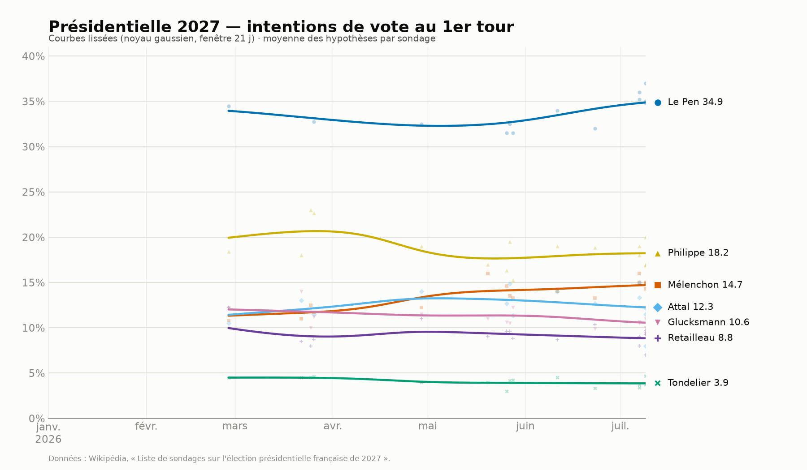

<<<<<<< HEAD
# Julesfress.github.io
=======
# Sondages présidentielle 2027 — courbes lissées

Génère un graphique des intentions de vote au **1er tour** de l'élection
présidentielle française de 2027, à partir des sondages agrégés sur Wikipédia.

Candidats suivis : **Le Pen, Mélenchon, Philippe, Attal, Glucksmann, Retailleau,
Tondelier**. Période : à partir de **janvier 2026**.



## Installation

```bash
pip install -r requirements.txt
```

## Utilisation

```bash
python sondages_2027.py                 # génère sondages_2027.png
python sondages_2027.py -o chart.png    # choisit le fichier de sortie
python sondages_2027.py --show          # ouvre une fenêtre interactive
python sondages_2027.py --watch 60      # régénère toutes les 60 min si la page a changé
```

## Mise à jour automatique

Les données sont lues **en direct** sur Wikipédia à chaque exécution : le
graphique reflète donc toujours l'état courant de la page. Quand de nouveaux
sondages y sont ajoutés, il suffit de **relancer le script** — aucune donnée
n'est figée dans le code.

Pour une actualisation réellement automatique, deux possibilités :

- **`--watch N`** : le script tourne en continu, revérifie la page toutes les
  `N` minutes et ne régénère l'image que si la page a changé (comparaison par
  empreinte MD5).
- **Une tâche planifiée** qui relance le script périodiquement, par exemple avec
  `cron` (Linux/macOS) :

  ```cron
  # tous les jours à 8h
  0 8 * * *  cd /home/julesfress/Documents/sondpres && python3 sondages_2027.py
  ```

## Comment ça marche

1. **Récupération** — l'API de Wikipédia renvoie le HTML rendu de la page ainsi
   que l'horodatage de la dernière révision (affiché sur le graphique).
2. **Analyse** — on ne conserve que les tableaux de la section « Sondages
   concernant le premier tour » dont l'année est ≥ 2026. La sélection se fait par
   le **contenu** (titre de section + noms de colonnes), pas par un index fixe,
   afin de résister aux réorganisations de la page (ajout d'une année 2027, etc.).
3. **Agrégation** — un même sondage teste plusieurs *hypothèses* (des
   combinaisons de candidats différentes). Pour chaque sondage et chaque
   candidat, on prend la **moyenne** des hypothèses où ce candidat figure.
   - Au 1er semestre 2026, la colonne du RN s'appelait « Candidat RN »
     (candidature Le Pen / Bardella indécise) : seules les valeurs explicitement
     attribuées à **Le Pen** sont retenues pour sa courbe.
   - Les cellules renvoyant à un autre candidat (« 9 Hollande », « Villepin »…)
     sont ignorées pour la colonne concernée.
4. **Lissage** — régression locale à noyau gaussien (fenêtre de 21 jours), sans
   dépendance à SciPy.
5. **Rendu** — Matplotlib. Palette validée pour le daltonisme (chaque candidat a
   une couleur **et** un marqueur distincts, plus un libellé direct à droite).

## Réglages rapides (en tête de `sondages_2027.py`)

| Constante         | Rôle                                             |
|-------------------|--------------------------------------------------|
| `CANDIDATES`      | liste des candidats, couleurs et marqueurs       |
| `START`           | date de début (défaut : 1er janvier 2026)        |
| `BANDWIDTH_DAYS`  | fenêtre du lissage en jours (défaut : 21)        |
>>>>>>> 875d1af (Initial commit)
